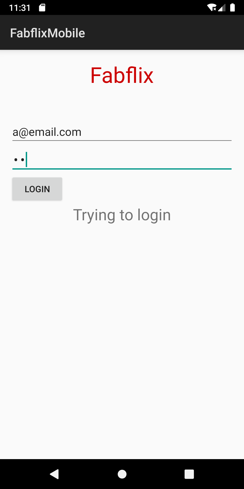
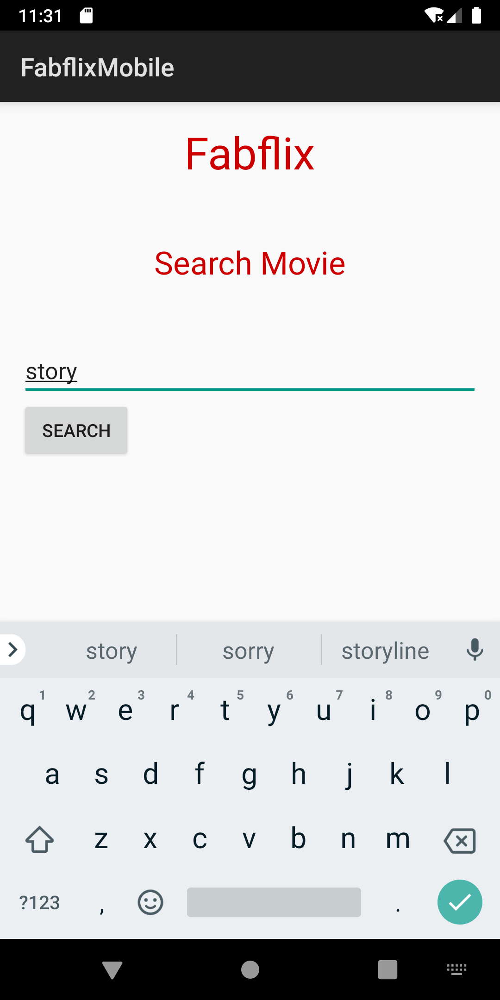
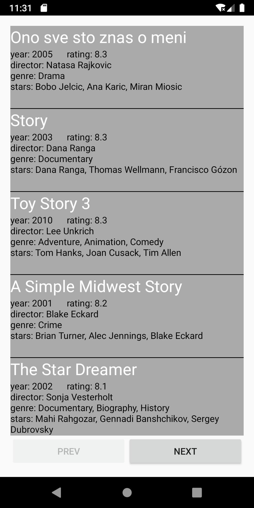
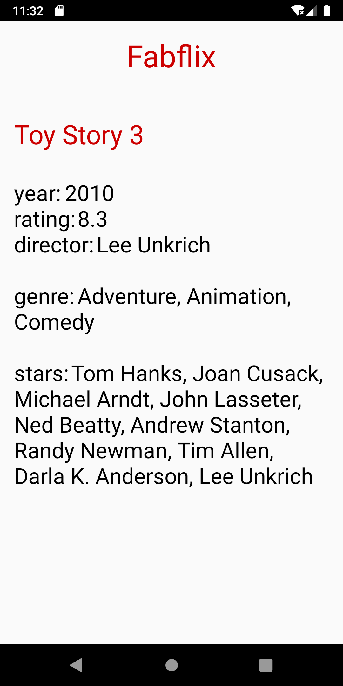

# Fabflix-Android

A simple Android version of [Fabflix](https://github.com/mingwandowski/Fabflix)

## Functionalities

 * [x] Login authorization
 * [x] Search movie based on title
 * [x] Fuzzy search
 * [x] Single movie page

## Demo account

* email: `a@email.com`
* password: `a2`

## Related

[Fabflix Web](https://github.com/mingwandowski/Fabflix) -- Web version using Java, JavaScript, HTML/CSS, MySQL.

[Fabflix-iOS](https://github.com/mingwandowski/Fabflix-iOS) -- iOS version using Swift 5, UIKit framework.

## Demonstration

